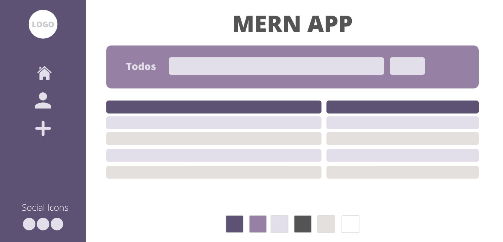

# MERN-STEP-BY-STEP

## Summary

Step-by-step guide on how to build a simple MERN stack application. This is basically my notes plus an attempt to explain it further to my future myself.

##### What we are going to do?

We will be building a MERN full-stack Todo app with `React CDN` for simplicity, however, you could use this backend as a model to any front-end interface, as our back-end is 100% autonomous.

We will be passing data with props, creating state, and connecting our Front-End to Back-End by fetching the data from our Back-End. After you style the application (I have provided three mockups/wireframe with color pallets), we are going to deploy our application with Heroku, so the world can see what we have accomplished.

`This is meant for beginners as an exercise or learning project.`

#### Demo: https://todo-app-with-mern-stack.herokuapp.com/

## Let's start

#### First, what MERN stack stands for?

MERN is a full-stack web development framework, composed of four technologies MongoDB, ExpressJS, ReactJS, NodeJS

`MongoDB`: A document-oriented, No-SQL database used to store your app data.

`NodeJS`: It is a JavaScript runtime environment. It provides you with the ability to run JavaScript in a machine rather than in a browser.

`ExpressJS`: A framework layered on top of NodeJS, used to build the backend of a site using NodeJS functions and structures. Since NodeJS was not developed to make websites but rather run JavaScript on a machine, ExpressJS was developed.

`ReactJS`: It is a library created by Facebook. It is used to build UI components that create the user interface of the single page web application.


#### Why MERN stack?

Mainly because this stack is completed composed utilizing the JavaScript language, most code you are writing from back to front is javaScript.

[More info can be found here: ](https://www.educative.io/edpresso/what-is-mern-stack)

**[⬆ Back to Top](#summary)**

### Create a repository

`mkdir mern-app`

`touch mern-app/server.js`
`npm init -y`
`npm install express mongoose --save`

### Required express and mongoose

```
//=============================
//      Dependencies
//=============================
const express = require("express");
const mongoose = require("mongoose");
```

### Add environment variables and set the App to Heroku deployment

Setting the `process.env.PORT || localPortNumber` will ensure that your application will no matter what environment it is being connected, whether it is Heroku `process.env.PORT` or it is in your local machine `localPortNumber`

```
//=============================
//  Environment Variable
//=============================
const app = express();
const mongoURI = process.env.MONGODB_URI || "mongodb://localhost:27017/merncrud";
const PORT = process.env.PORT || 3000;
```

### Make the connection with MongoDB

Set the the mongoURI pass the mongoDB parser and if the connection is successful log a message.

```
//=============================
//  MongoDB Connection
//=============================
mongoose.connect(mongoURI, { useNewUrlParser: true }, () => {
  console.log("Established Connection with mongo", mongoURI);
});
```

### Handle connection error message and mongo disconnected

```
//======================
//  DB Messaging
//======================
mongoose.connection.on("error", (err) => console.log(err.message));
mongoose.connection.on("disconnected", () => console.log("mongo disconnected"));
```

### Now define the App Listening to your PORT variable

Set the variable `app` to listen to the appropriate `PORT` in your local machine it will run on 3000 (or whatever number you assigned to `PORT`) or it will understand that you are in a HEROKU environment.

```
//=================================================
// Listening on Port 3000 or Default to HEROKU
//=================================================
app.listen(PORT, () => {
  console.log(`Ascoltando al porto... ${PORT}`);
});
```

### Creating the Models directory

Create a models folder and add a todos.js file and a todoSchema

`mkdir models`

`touch models/todos.js`

In your `touch models/todos.js` add your dependencies, create your Schema, your models variable, and export it.

```
//=============================
// Dependencies
//=============================

const mongoose = require("mongoose");

//=============================
//      Todos Schema
//=============================
const todoSchema = new mongoose.Schema({
  description: String,
  complete: Boolean,
});

//=============================
// Todos Models
//=============================

const Todos = mongoose.model("Todo", todoSchema);

//=============================
// Export Todos Models
//=============================
module.exports = Todos;

```

### Add a Middleware and fix the Model

Middlewares are just "functions" that will assist your server to run appropriate tasks.

The Middleware needs to be placed at the top of the `server.js`, right bellow the environment variables

```
//=============================
//  Middleware
//=============================
app.use(express.urlencoded({ extended: false })); // extended: false - does not allow nested objects in query strings
app.use(express.json()); //use .json(), not .urlencoded()
app.use(express.static("public")); // we need to tell express to use the public directory for static files... this way our app will find index.html as the route of the application! We can then attach React to that file!
```

Add the Model section in your server, later we will be moving it to it's own controllers folder. Like creating components in the same file in React and later assigning the components to it's own directory and file; it is a common practice build out sections in our server side ensure they are working properly and later on moving them to their own controller folder.

##### …

```
//=============================
//  Model
//=============================

const Todos = require("./models/todos.js");

//==========
// GET
//==========
app.get("/todos", (req, res) => {
  Todos.find({}, (err, foundTodos) => {
    res.json(foundTodos);
  });
});

```

**[⬆ Back to Top](#summary)**

### Create the post route

The post route will be placed underneath our GET route.

```
//==========
// POST
//==========
app.post("/todos", (req, res) => {
  Todos.create(req.body, (err, createdTodo) => {
    res.json(createdTodo); //.json() will send proper headers in response so client knows it's json coming back
  });
});

```

### Create the Controllers

Now, we can create the controller and move the Models to the controller. Don't forget to reference your controllers inside the `server.js`, otherwise, it won't work.

`mkdir controllers`
`touch controllers/todos.js`

### Move Models

Move the `get` and `post` to the `controllers/todos.js`. Notice how we require express and assign it to a variable called `router`, similarly with what we have done with the `app` variable inside the `server.js`. Next, we are getting our Todos from Models, underneath it we will add our rest full routers, and finally exporting them to be accessible in our `server.js` .

```

//=============================
// Dependencies
//=============================
const express = require("express");
const router = express.Router();

//=============================
//  Model
//=============================

const Todos = require("../models/todos");

//==========
// GET
//==========
router.get("/", (req, res) => {
  Todos.find({}, (err, foundTodos) => {
    res.json(foundTodos);
  });
});

//==========
// POST
//==========
router.post("/", (req, res) => {
  Todos.create(req.body, (err, createdTodo) => {
    res.json(createdTodo); //.json() will send proper headers in response so client knows it's json coming back
  });
});

module.exports = router;

```

**[⬆ Back to Top](#summary)**

### Last step in our controller setup:

To complete the controllers set up, make it available in the `server.js` right before our `app.listen()` add the routers, importing them from our controllers.

Assign controllers to a variable

Pass it as second params in `app.use()`

First params, is your route path.

```

//=============================
//  Routers
//=============================
const todosController = require("./controllers/todos");

app.use("/todos", todosController);

```

Initiate your APP by running `nodemon`

##### Use Curl to test it out:

`curl -X POST -H "Content-Type: application/json" -d '{"description":"weee","complete":true}'`

## Create a Public directory

Create a Public directory and `touch style.css & touch index.html`, and `mkdir js` and `touch js/App.js`

Link the `style.css` and `App.js` alongside the `React CDN` scripts to the `index.html`

```
<!DOCTYPE html>
<html lang="en" dir="ltr">
  <head>
    <meta charset="utf-8" />
    <title>React State Store</title>
    <script src="https://cdnjs.cloudflare.com/ajax/libs/react/16.3.2/umd/react.production.min.js"></script>
    <script src="https://cdnjs.cloudflare.com/ajax/libs/react-dom/16.3.2/umd/react-dom.production.min.js"></script>
    <script src="https://cdnjs.cloudflare.com/ajax/libs/babel-standalone/6.26.0/babel.min.js"></script>
    <script type="text/babel" src="./js/app.js"></script>
  </head>
  <body>
    <div class="root">
      <!-- React will load our App here -->
    </div>
  </body>
</html>
```

**[⬆ Back to Top](#summary)**

## Go to App.js

The `App.js` is your main React Component and it is the entry point of your application, it will manage the state, data, and other components in your application.

```
class App extends React.Component {
   render() {
    return (
      <div>
        <h1>React is Running</h1>
        <button>Get Todos</button>
      </div>
    );
  }
}
ReactDOM.render(<App />, document.querySelector(".root"));

```

## Set state and fetch the data from your localhost, in this case, `http://localhost:3000/`

```
state = {
    todos: [],
  };


  getData = () => {
    fetch("http://localhost:3000/todos")
      .then((response) => response.json())
      .then((data) => this.setState({ todos: data }));
  };

```

### Pass the getData Method onClick and map over the current todos if any

##### Use curl to test it out:

`curl -X POST -H "Content-Type: application/json" -d '{"description":"Code Master","complete":true}'`

```
<button onClick={this.getData}>Get Todos</button>

        <ul>
          {this.state.todos.length > 0 &&
            this.state.todos.map((todo) => {
              return <li>{todo.description}</li>;
            })}
        </ul>
```

### Add the componentDidMount() between state and getData()

```
 componentDidMount() {
    this.getData();
  }

```

**[⬆ Back to Top](#summary)**

#### At this point, you should have a functional react application with some todos, if you had run the curl command I mentioned previously.

Now, let's add a delete todos route and create todo using our front-end with React.

### Add Delete and Update Routes

They both will be added to the `controllers/todos.js` file. You will use mongoDB to locate the specific file and update or remove, to update you will do `findByIdAndUpdate()` and `findByIdAndRemove()`

```
//==========
// Delete
//==========
router.delete("/:id", (req, res) => {
  Todos.findByIdAndRemove(req.params.id, (err, deletedTodo) => {
    res.json(deletedTodo);
  });
});

```

##### Use curl to test it out:

`curl -X DELETE http://localhost:3000/todos/58f79d490708714536c02474`

```
//==========
// Update
//==========

router.put("/:id", (req, res) => {
  Todos.findByIdAndUpdate(req.params.id, req.body, (err, updatedTodo) => {
    res.json(updatedTodo);
  });
});

```

##### Use curl to test it out:

`curl -X PUT -H "Content-Type: application/json" -d '{"description":"I updated this","complete":true}' http://localhost:3000/todos/58f7a4fd26b1a345e9281cb8`

## Create a todos form

Since we already created our `POST` request, our backend is ready with our `app.post` route, we can create a form in react to feed our back-end

#### The form will contain a handleChange and handleSubmit events

    handleChange(): Will handle the changes in the form, by setting the state to the value typed by the user

    handleSubmit(): Will get the data changed and send it to the backend

```
  handleChange = () => {
    this.setState({
      [event.target.id]: event.target.value,
    });
  };
```

```
  handleSubmit = (event) => {
    event.preventDefault();
    fetch("/todos", {
      body: JSON.stringify({ description: this.state.description }),
      method: "POST",
      headers: {
        Accept: "application/json, text/plain, */*",
        "Content-Type": "application/json",
      },
    })
      .then((response) => response.json())
      .then((newTodo) => {
        this.setState({
          todos: [newTodo, ...this.state.todos],
          description: "",
        });
      });
  };

```

```
  {/* Add a form to create Todos  */}
        <form onSubmit={this.handleSubmit}>
          <label htmlFor="description">Description</label>
          <input
            type="text"
            value={this.state.description}
            id="description"
            onChange={this.handleChange}
          />
          <input type="submit" />
        </form>
```

**[⬆ Back to Top](#summary)**

## Delete Todos

Add a button inside our `map()`and name it delete or something meaningful. Also, add an `onClick()` event to the button. At this point, you want to `this.deleteTodo()` that will take two parameters the `todo_id` and `index` of the current value being mapped.

Then, we define the `deleteToDo` method above our `Render()` by fetching the exact route, passing the second argument `method:` as `DELETE` and generating a promise that will update the state of your app by slicing the specific item generating a new array with all the items prior and after our target item.

Add the button in Map

```
<ul>
{this.state.todos.length > 1 &&
  this.state.todos.map((todo, index) => {
    return (
      <li>
        {todo.description}
        <button onClick={() => this.deleteToDo(todo._id, index)}>
          Delete
        </button>
      </li>
    );
  })}
</ul>

```

```
  deleteToDo = (id, index) => {
    fetch("todos/" + id, {
      method: "DELETE",
    }).then((data) => {
      this.setState({
        todos: [
          ...this.state.todos.slice(0, index),
          ...this.state.todos.slice(index + 1),
        ],
      });
    });
  };

```

## Refactoring our app so it is more realistic with separation of concerns

Always look for a clean easy to read component when developing React Applications. Once your component starts to look crowded try to break it into two components by separating concerns.

To illustrate this concept, we will be adding a new functional component called `ToDoItem`, by moving our `<li>` inside our new component, and by passing props we will achieve the same end result with a cleaner approach.

New Component:

```
const ToDoItem = (props) => {
  return (
    <li>
      {props.todo.description}
      <button onClick={() => props.deleteTodo(props.todo._id, props.index)}>
        Delete
      </button>
    </li>
  );
};

```

The refactored map() with ToDoItem and its props:

```
<ul>
  {this.state.todos.length > 0 &&
       this.state.todos.map((todo, index) => {
    return (
           <ToDoItem
             todo={todo}
             index={index}
             deleteTodo={this.deleteTodo}
           />
          );
     })}
</ul>

```

**[⬆ Back to Top](#summary)**

## Update Todos

### Refactoring our ToDoItem functional component

First, let's refactor the `ToDoItem()` component so we will surround the `props.todo.description` and add a ternary conditional that will add a class if `props.todo.complete` is set to true

### Code the Update Method

In the `updateToDo` method, we will change the value of our `todo.complete` to be the exact opposite of its current state, therefore we type the (isNOt) represented by the `!` in front of the word `todo.complete`. Next, we will fetch the data from our controller Update Route by using a fetch API call.

Furthermore, once the item is updated, we will use a promise and pass our `getData()` created previously.

```
updateToDo = (todo) => {
    todo.complete = !todo.complete;
    fetch(`todos/${todo._id}`, {
      body: JSON.stringify(todo),
      method: "PUT",
      headers: {
        Accept: "application/json, text/plain, */*",
        "Content-Type": "application/json",
      },
    })
      .then((response) => response.json())
      .then((data) => {
        this.getData();
      });
  };

```

So `App` is the highest component in our application, also it is where our state is managed, therefore, our update method will be placed in App.js and we will pass it down to the appropriate component, in our case the ToDoItem Component.

```
<ToDoItem
todo={todo}
index={index}
deleteTodo={this.deleteTodo}
updateToDo={this.updateToDo}
/>
```

Now lets created a new button in our `ToDoItem` component that will toggle

```
<button onClick={() => props.updateToDo(props.todo)}>Complete</button>
```

**[⬆ Back to Top](#summary)**

### Add Some Style

Now Let's add some style. Feel free to choose your own style and color pallet, however, I have put these three wireframes and color pallets that I come up with, feel free to use it or add your own.

Sometimes in a real-world scenario, you would get a design sheet directly from your company's design department or directly from a product/project owner. Maybe using one of my suggested designs is a way of practicing this concept.

**Pro tip**: When designing, I usually pick two main colors, I use some small variation of these colors and I add those to any contrast element.

#### Design One:


Color Pallet:

```
    #3aafa9
    #2b7a78
    #def2f1
    #545454
    #c7c9cd
    #ffffff
```

#### Design Two:



Color Pallet:

```
    #5d5174
    #9680a4
    #e2deea
    #545454
    #e4e0dd
    #ffffff
```

#### Design Three:


Color Pallet:

```
    #545454
    #edecec
    #e4e0dd
    #c8dbf8
    #ffffff
```

**[⬆ Back to Top](#summary)**

## Heroku Deployment

#### Initial Heroku Set Up

Access Heroku and [create a new account ](https://signup.heroku.com/)

Install Heroku CLI Tools [CLI Tools](https://devcenter.heroku.com/articles/heroku-cli)

Heroku CLI will allow you to access terminal commands from Heroku, such as `heroku login`

Type `heroku login` anywhere in your terminal

Follow prompts to sync your Heroku account with your computer

#### Create a New App on Heroku

Access your account dashboard at [https://dashboard.heroku.com/apps](https://dashboard.heroku.com/apps)

Click on the `New` dropdown button and select `Create new app`


Add a unique name to your app and click on the `create app` button


### Before we deploy the app Let's add an addon that is Heroku's version of MongoDB

This addon is called MongoLab. MongoLab as I mentioned is a Heroku's version of MongoDB and it make sure our application runs as expected.

#### Important:

MongoLab is a free addon for as long as you choose the `FREE` version. You will be required to add your credit card. So, just make sure you got the `FREE` version!

Click on the `Resource` Tab
Under the `Add-ons` section search for `mLab MongoDB`


A modal will display.
Under the `Plan name` Select the Free version called `Sandbox - Free`
Click on the button `Provision`

##### Please note that any other sandbox version will cost you money


#### Initialize Heroku repo

Now let's change focus on the `Deploy` tab

At this point, if you do not have a GitHub repo created, just run `git init` If you already have a repo created you can skip this previous step.

Now we can set heroku as a remote repo

`$ heroku git:remote -a todo-app-with-mern-stack`

#### Important:

`Make sure you have a .gitignore file and add node_modules to it, as shown below:`

```
node_modules
/node_modules
*node_modules

```

#### Now run git add, commit, and push it to heroku master

Notice that we are not pushing it to the origin master although we do have an origin (representing our GitHub repo), we are changing focus to the `heroku master`

```
git add .
git commit -m "Pushing my app to Heroku "
git push heroku master

```

It can take a minute. Once it is completed, you can type `heroku open` You should be able to see your app deployed.

### Demo: https://todo-app-with-mern-stack.herokuapp.com/

**[⬆ Back to Top](#summary)**
